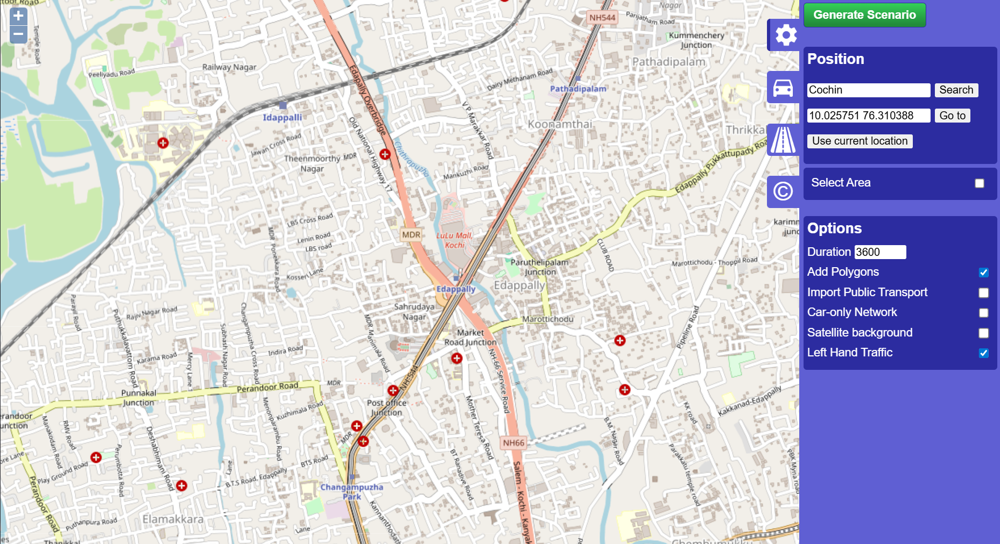

# Traffic Simulation

main folder for project ( `TrafficSim`). Inside that, presents three subfolders:

- **`config/`**: This is where SUMO map and route files will live.
    
- **`src/`**: This is where Python logic (the "brain") will go.
    
- **`data/`**: save simulation logs and results here later.

in python environment `env` we install two libraries `traci` that talks to SUMO and `sumolib` 

`config/` folder with a real map using the **OSM Web Wizard**.

![[Pasted image 20260217163446.png]]

# Traffic Index Idea
